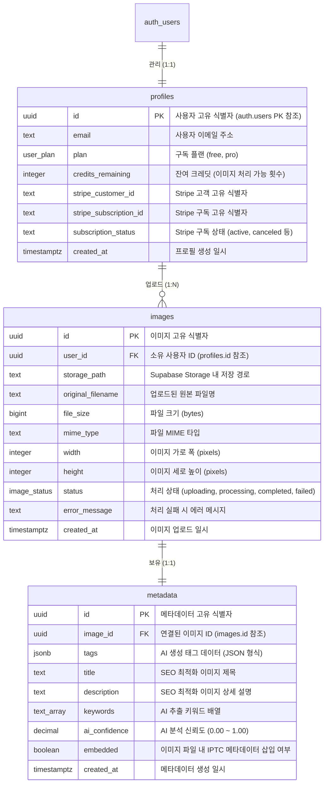

# TagStock 데이터베이스 ERD

이 문서는 Mermaid를 사용하여 TagStock의 데이터베이스 스키마를 설명합니다.

## 테이블 설명

### profiles
사용자 프로필 정보, 구독 상태 및 잔여 크레딧을 저장합니다. Supabase Auth의 user 테이블과 직접 연결됩니다.

### images
업로드된 이미지 정보(저장 경로 및 현재 처리 상태 포함)를 저장합니다.

### metadata
제목, 설명, 태그를 포함하여 각 이미지에 대해 AI가 생성한 메타데이터를 저장합니다. 또한 메타데이터가 파일에 임베드되었는지 여부를 추적합니다.
